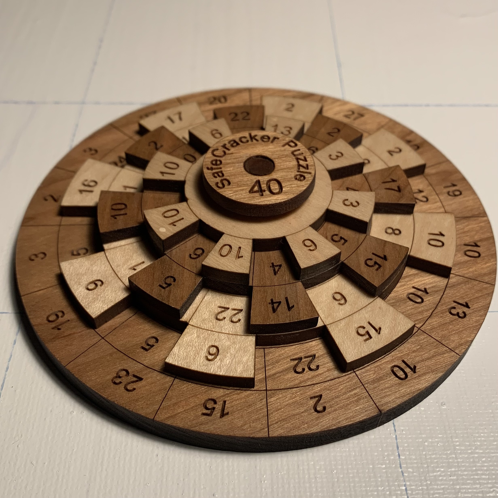

# Various Puzzles that I have used C++ to solve

## Sudoku Solver
I wrote this during a stage when I was very class-focused in C++. It is tedious to enter each number, but hey, it works.

## Rotation Puzzle
I got a rotation puzzle from my Aunt for christmas. I asked her if she considered it cheating to solve it by writing a program (she said she did not). It is a simple puzzle to solve with code.

This was the puzzle:

</img>

The goal is to get each column add up to 40. As you can surmise this is just a guess and check problem since the numbers are random. The only way to make the solve faster is to abandon an iteration when the sum is greater than 40. Not all numbers on each ring are shown at once, so this at least provided a challenge.