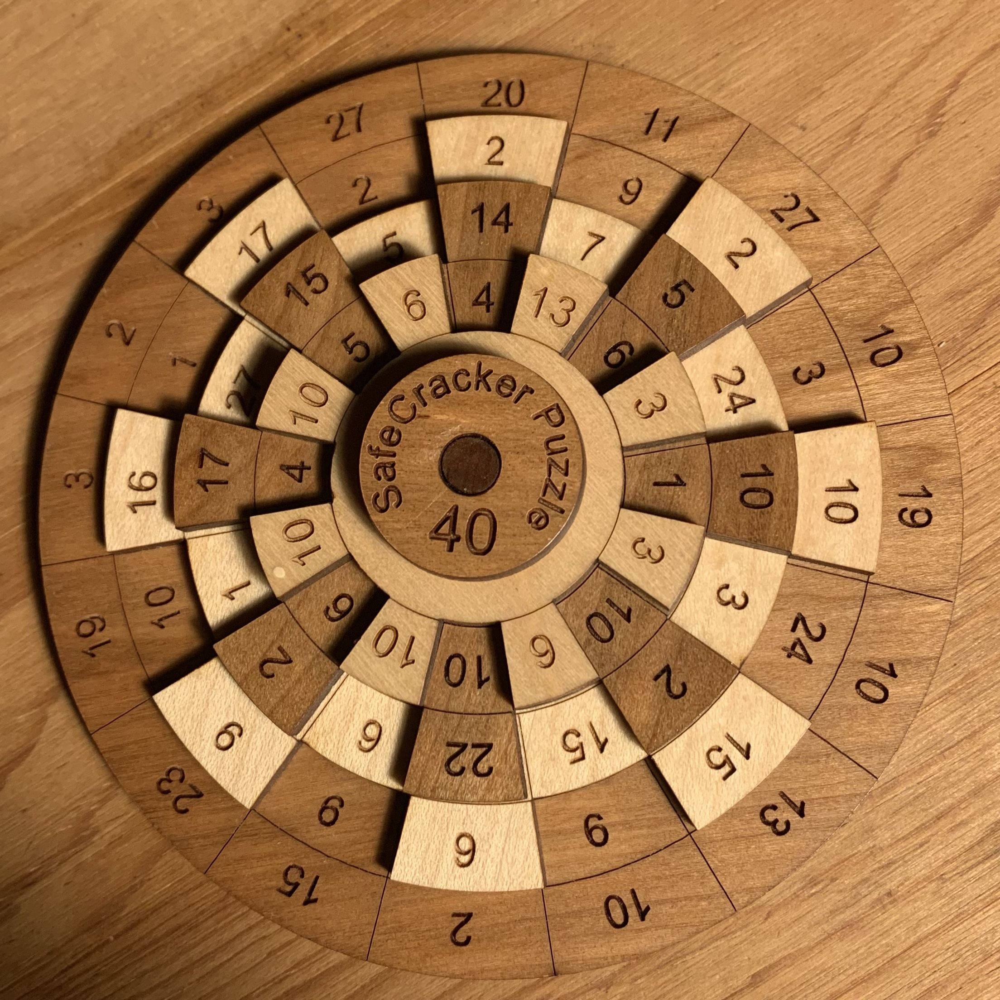

# Various Puzzles that I have used C++ to solve

## Sudoku Solver
I wrote this during a stage when I was very class-focused in C++. It is tedious to enter each number, but hey, it works.

## Rotation Puzzle
I got a rotation puzzle from my Aunt for christmas. I asked her if she considered it cheating to solve it by writing a program (she said she did not). It is a simple puzzle to solve with code.

This was the puzzle:

</img>

The goal is to get each column add up to 40. From the starting position that I manually entered into the vectors in rotation_puzzle.cpp, the correct rotation order is 0, 6, 7, 6; these are counter-clockwise rotations.
It was fun to model a physical object in code, especially when that object can be manipulated and solved.